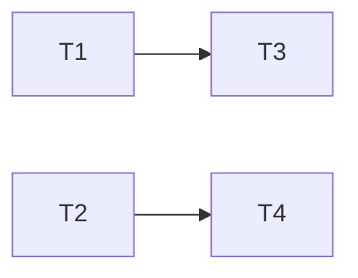

# Plan template

A fresh `/execute-plan` session reads only the plan and the repo. Put repo-specific and
plan-specific facts here. The general process lives in the execute-plan skill.

````markdown
# <Plan title>

status: draft | in-progress | done
commit-mode: orchestrator-commits | branch-queue
language: ruby | rust | <other>
panel: <names from ~/.claude/reference/rosters.md>

## Intent

<2 to 4 sentences: what this delivers and why now. Link the roadmap line.>

## Grounding

<Date, git SHA, and the files checked. Where docs and code disagreed, and which won.>

## Compatibility

| Surface | Verdict | Evidence |
|---|---|---|
| <name> | must keep / free to break | <paths, tags, consumers> |

<Trade reports the user decided, with the decision.>

## Spike findings

| Question | Result | Evidence |
|---|---|---|

<Or "none".>

## Shared files

<Files only the main session edits, e.g. the top-level require file, gemspec or
Cargo.toml, lint config, spec helper. Cards hand back 1-line diffs for these.>

## Rejected options

<Refactors and simplifications considered and not taken, 1 line of reason each.>

## Open decisions

<Anything deferred. No card that depends on one of these may start.>

## Dependency graph



## Tasks

<Task cards, per task-card.md.>

## Integration checks

<Checks after the last card lands: full suite, lints, and any manual pass the user
owes, by name.>

## Execution log

<Written by /execute-plan. Base branch, then 1 line per event: card started, reviewed,
landed with SHA, blocked.>
````
